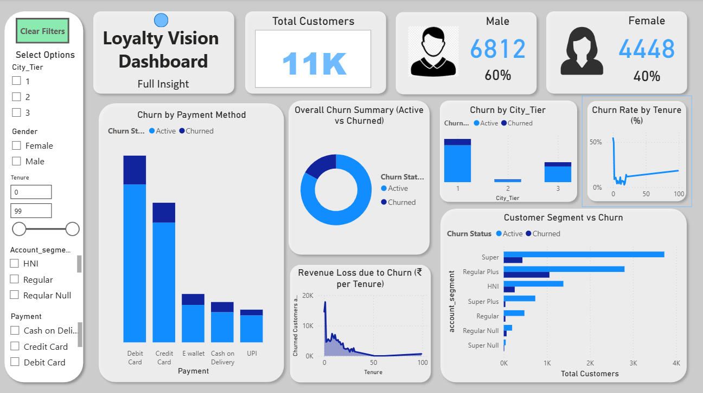

# 📂 LoyaltyVision Telecom Churn Analysis

## 📌 Project Overview
This project analyzes **telecom customer churn** end-to-end using **Excel, SQL, and Power BI**.  
The workflow includes **data cleaning (Excel)**, **analysis (SQL)**, and **visualization (Power BI)** to identify churn drivers, customer behavior patterns, and revenue impact, helping support business decisions and retention strategies.  

---

## 🛠️ Tools & Technologies
- **Excel** → Data cleaning & preprocessing  
- **SQL (MySQL)** → Data exploration & analysis  
- **Power BI** → Dashboard & visualization  
- **GitHub** → Project documentation and version control  

---

## 🧹 Data Cleaning (Excel)
Before analysis, the raw dataset was cleaned using **Excel**:
- Removed duplicates & handled missing values  
- Standardized column names and formats  
- Corrected inconsistent values (e.g., gender, city tier, payment methods)  
- Created derived fields for tenure buckets and revenue growth  

The cleaned dataset was then imported into **MySQL** for structured analysis.  

---

## 📊 SQL Analysis
The SQL scripts (`telecom_analysis.sql`) include:  

1. **Data Quality Checks**
   - Row counts, missing values, summary statistics  

2. **Customer Demographics & Segmentation**
   - Gender, Payment Methods, City Tier, Marital Status, Account Segments  

3. **Churn Analysis**
   - Churn distribution across demographics & tenure buckets  
   - Cohort analysis (tenure groups)  
   - Revenue lost vs retained due to churn  

4. **Advanced Insights**
   - Ranking customers by revenue  
   - Identifying at-risk customers (short tenure + declining revenue)  
   - Combined segmentation (Gender + Marital Status + City Tier)  

📌 **Key SQL Queries include:**  
- Churn by City Tier  
- Cohort Analysis (Tenure Groups)  
- Revenue impact of churn  
- Churn by Payment Method  
 
---

## Key Features:
- **Filters**: City Tier, Gender, Tenure, Account Segment, Payment Method  
- **KPIs & Visuals**:
  - Churn rate by customer segment  
  - Revenue lost vs retained due to churn  
  - Churn by payment method, marital status, and tenure  
  - Segment-wise churn heatmaps  

---

## 🧩 Example SQL Query – Churn by City Tier
```sql
SELECT City_Tier, 
       COUNT(*) AS total_customers, 
       SUM(CASE WHEN Churn = 1 THEN 1 ELSE 0 END) AS churned_customers
FROM telecom
GROUP BY City_Tier
ORDER BY churned_customers DESC;
```

--- 

## Dashboard Preview:
  

*(If GitHub doesn’t render, download `LoyaltyVisionDashboard.pbix` to explore the interactive dashboard.)*  

---

## 🔑 Insights
- Certain **City Tiers and Segments** show the highest churn rates.  
- **Payment method** choice strongly influences churn probability.  
- Customers with **shorter tenure and negative revenue growth** are most at risk.  
- A significant percentage of **monthly revenue is lost due to churn**, highlighting retention importance.  

---

## 📂 Repository Structure
├── telecom_analysis.sql # SQL queries & analysis  
├── LoyaltyVisionDashboard.pbix # Power BI dashboard  
├── Dashboard.png # Screenshot of dashboard  
└── README.md # Project documentation  

---

## 🚀 How to Use
1. Perform **data cleaning in Excel** (dataset included in repo if available).  
2. Run `telecom_analysis.sql` in MySQL Workbench (or any SQL environment).  
3. Open `LoyaltyVisionDashboard.pbix` in Power BI Desktop to explore the dashboard.  

---

## 📬 Contact
👩‍💻 **Poornima V**  
📧 poornimagowda6464@gmail.com  
🔗 [LinkedIn](https://www.linkedin.com/in/contact-poornima)
